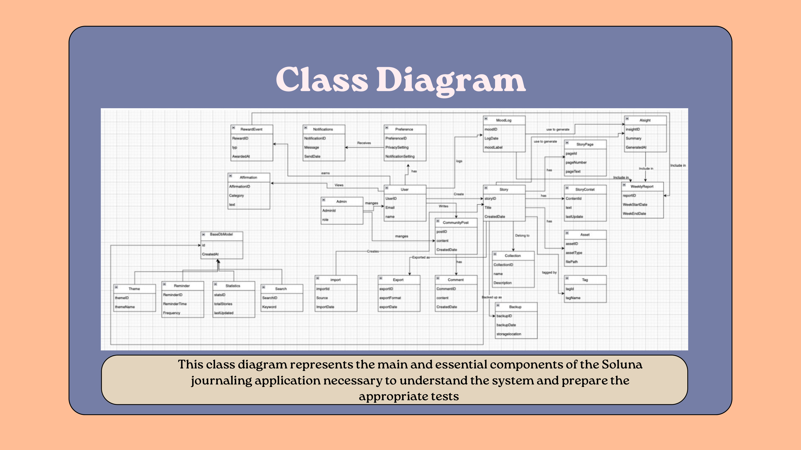
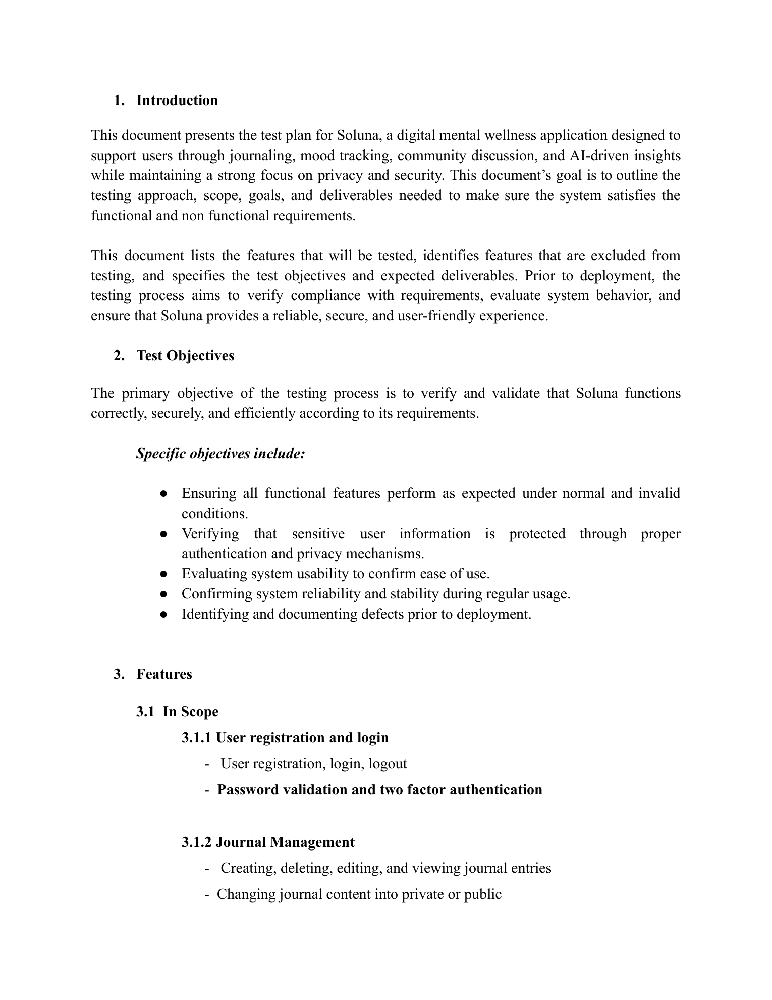
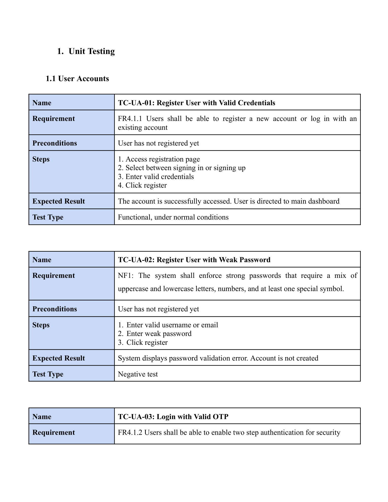
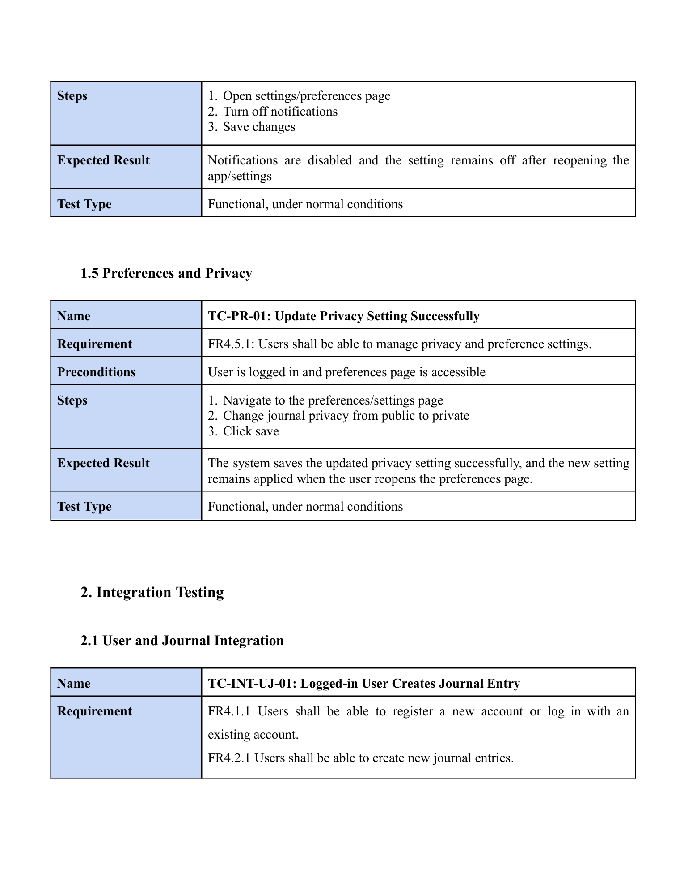
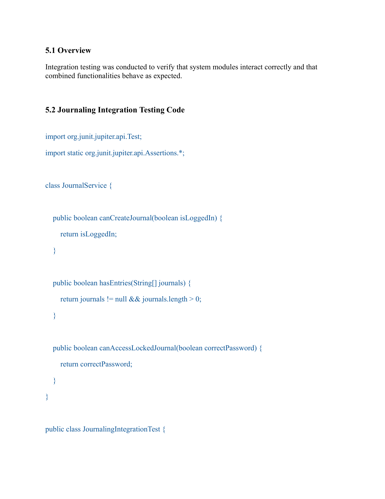
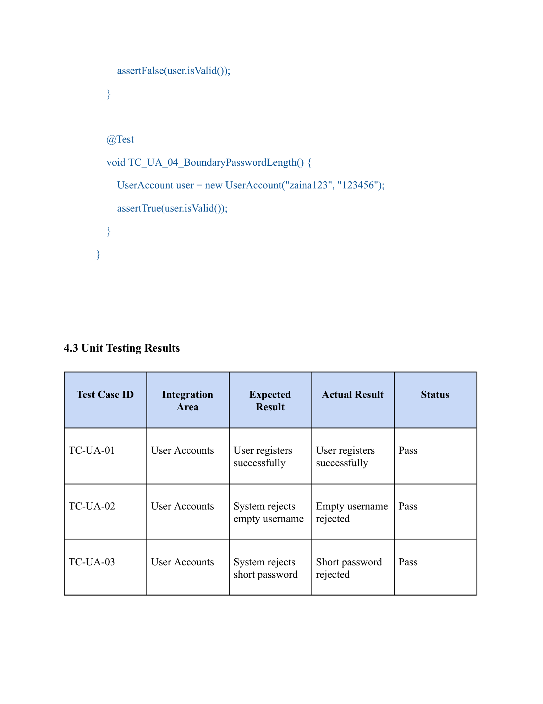

# Soluna

> **A software quality assurance case study demonstrating the complete testing lifecycle of a mental wellness application, from planning and test design to execution and validation.**

<p align="center">
  
</p>

---

## Overview

Soluna is a conceptual mental wellness platform designed to support users through secure journaling, mood tracking, community interaction, and privacy-focused features.

Unlike a traditional software project, this repository focuses on **how software quality is engineered**. It documents the complete software testing lifecycle, demonstrating how requirements were translated into a comprehensive test strategy, executed systematically, and validated thoroughly.

---

## System Overview

<p align="center">
  
</p>

The application includes several integrated modules, including:

- User Authentication
- Two-Factor Authentication
- Digital Journaling
- Mood Tracking
- Community Forums
- Notifications
- Privacy & Security Controls

These modules were verified throughout multiple testing phases to ensure functional correctness and reliable interaction between components.

---

# Testing Lifecycle

Software quality is built progressively. Each phase contributed a different layer of confidence before the application could be considered ready for deployment.

---

## Phase 1 — Test Planning

<p align="center">
  
</p>

The planning phase established the foundation of the testing process by defining:

- Testing scope
- Functional requirements
- Non-functional requirements
- Test objectives
- Risks and assumptions
- Test environment
- Exit criteria

Careful planning ensured that every testing activity remained aligned with the project requirements.

---

## Phase 2 — Test Design

<p align="center">
  
</p>

After defining the testing strategy, comprehensive test cases were designed to verify the application's core functionality.

Testing techniques included:

| Technique | Purpose |
|-----------|---------|
| Equivalence Partitioning | Reduce redundant test cases while maintaining coverage |
| Boundary Value Analysis | Validate edge conditions |
| Decision Table Testing | Verify business rules |
| State Transition Testing | Validate workflow behavior |

---

### Sample Test Cases

<p align="center">
  
</p>

The designed test cases covered both expected system behavior and edge cases to ensure reliable functionality across multiple user scenarios.

---

## Phase 3 — Test Execution

<p align="center">
  
</p>

The planned test cases were implemented and executed using **JUnit**.

Execution included:

- Unit Testing
- Integration Testing
- Functional Verification
- Result Documentation
- Coverage Validation

Each execution result was documented to verify that the implemented behavior matched the expected outcomes.

---

## Test Results

<p align="center">
  
</p>

The execution phase confirmed successful validation of major application functionality, including authentication, journaling, mood tracking, notifications, and user interaction workflows.

---

# Technologies

- Java
- JUnit
- Software Quality Assurance
- Unit Testing
- Integration Testing
- Functional Testing

---

# Repository Structure

```text
Soluna
│
├── Phase 1
│   ├── Test Plan
│
├── Phase 2
│   ├── Test Design
│   ├── Test Cases
│
├── Phase 3
│   ├── JUnit Tests
│   ├── Test Execution
│   └── Test Reports
│
└── README.md
```

---

# Team Contributions

This project was developed collaboratively as part of a university software quality assurance course.

### My Contributions

My primary contributions focused on the software testing lifecycle, including:

- Developing the test plan and testing strategy
- Designing structured test cases
- Applying software testing techniques
- Contributing to testing documentation
- Executing and validating test cases
- Recording execution results and findings

The project was completed collaboratively, with each team member contributing to different stages of the planning, design, execution, and documentation process.

---

# Key Takeaways

Working on Soluna strengthened my understanding of software quality assurance by demonstrating that reliable software is achieved through structured planning, thoughtful test design, and systematic validation. This project reinforced the importance of comprehensive documentation and meticulous test execution in building confidence in software systems.
